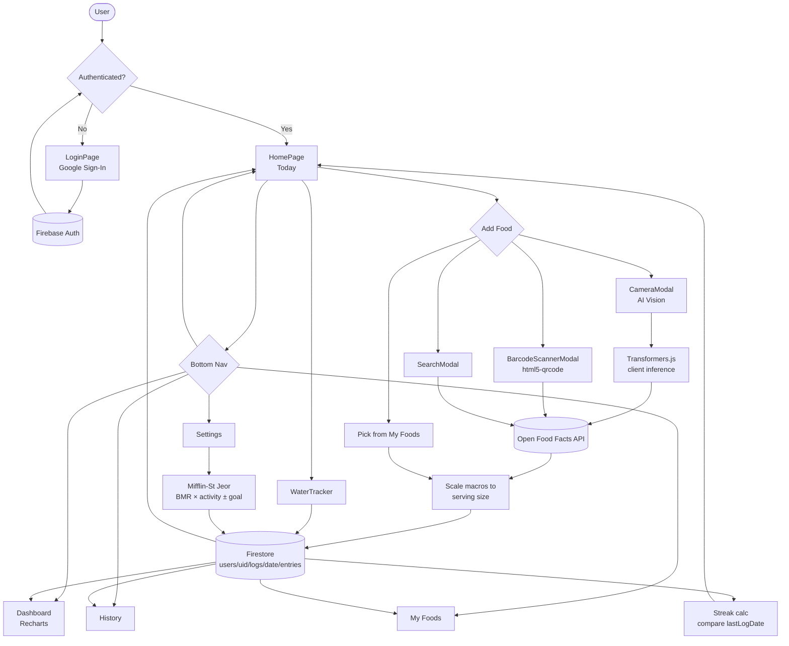
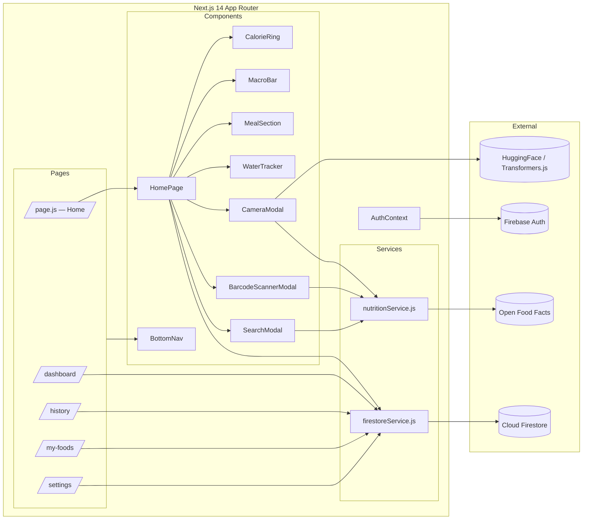

# Calories App — Diagrams

## 1. Flow Diagram (User → Data Path)



## 2. Workflow Diagram (Logging a Meal — Sequence)

```mermaid
sequenceDiagram
    actor User
    participant UI as HomePage
    participant Modal as Camera/Barcode/Search Modal
    participant AI as Transformers.js
    participant OFF as Open Food Facts
    participant Svc as firestoreService
    participant DB as Firestore
    participant Streak as Streak Logic

    User->>UI: Tap "Add Food"
    UI->>Modal: Open modal (portal)

    alt Photo
        User->>Modal: Capture image
        Modal->>AI: Run vision inference
        AI-->>Modal: Predicted food label
        Modal->>OFF: Search by label
    else Barcode
        User->>Modal: Scan code
        Modal->>OFF: GET /product/{code}.json
    else Text Search
        User->>Modal: Query string
        Modal->>OFF: Search endpoint
    end

    OFF-->>Modal: name, brand, macros (per 100g)
    User->>Modal: Set serving + meal type
    Modal->>Modal: Scale macros to serving
    Modal->>Svc: addFoodEntry(uid, dateKey, entry)
    Svc->>DB: write entries/{entryId}
    DB-->>Svc: ok

    Svc->>Streak: check lastLogDate vs today
    alt Next day
        Streak->>DB: currentStreak += 1
    else Same day
        Streak-->>Svc: no change
    else Gap > 1 day
        Streak->>DB: currentStreak = 1
    end
    Streak->>DB: lastLogDate = today

    DB-->>UI: snapshot update
    UI-->>User: Ring, macros, streak refresh
```

## 3. Component / Data Architecture


